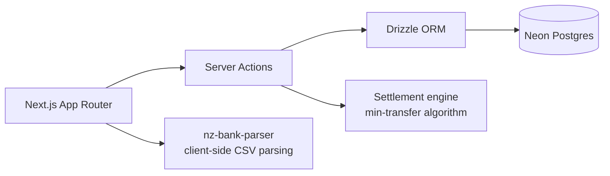

[](https://github.com/R1chi33333/flatsplit/actions/workflows/ci.yml)
[](https://codecov.io/gh/R1chi33333/flatsplit)
[](./LICENSE)

# FlatSplit — fair expenses for New Zealand flats

[Live Demo](https://flatsplit.vercel.app) · [Documentation](#getting-started) · [Report Bug](https://github.com/R1chi33333/flatsplit/issues/new?template=bug_report.md)

> Status: under active development, pre-v0.1.0.

## Why this exists

Flatting is how most young New Zealanders live, and every flat runs the same spreadsheet: rent by room size, power split evenly, groceries owed to whoever paid. Spreadsheets rot and nobody settles up. FlatSplit tracks shared expenses, imports transactions straight from your bank's CSV export, and tells everyone the fewest transfers needed to be square.

## Features

- Create a flat, invite flatmates with a code
- Record expenses with equal, ratio or fixed-amount splits
- Settlement view: who owes whom, with the minimum number of transfers
- Import bank CSV exports via [nz-bank-parser](https://github.com/R1chi33333/nz-bank-parser) and turn shared transactions into expenses in bulk
- One-click demo flat with realistic data, no signup needed
- All amounts in integer cents, so totals always add up

## Architecture



## Tech Stack

Next.js 15 (App Router), TypeScript (strict), Neon Postgres, Drizzle ORM, NextAuth, Tailwind CSS, nz-bank-parser, Vitest, Playwright. Deployed on Vercel.

## Getting Started

```bash
git clone https://github.com/R1chi33333/flatsplit.git
cd flatsplit
npm ci
cp .env.example .env.local   # fill in database URL and auth secret
npm run dev
```

## Testing

```bash
npm test               # unit tests (settlement engine, money utilities)
npm run test:coverage  # with coverage report
```

## Roadmap

See [ROADMAP.md](./ROADMAP.md).

## License

[MIT](./LICENSE)
