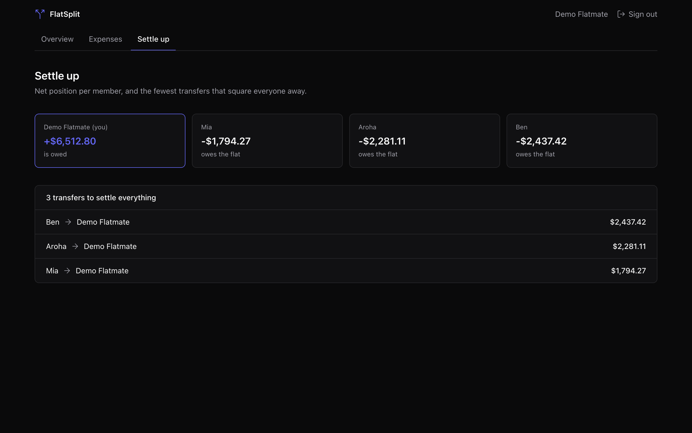
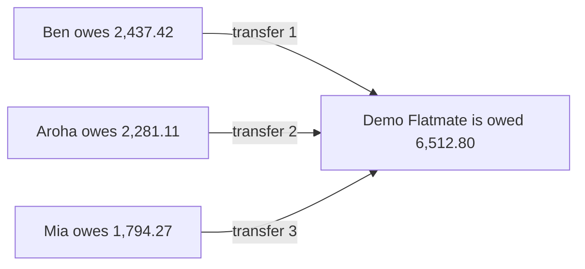
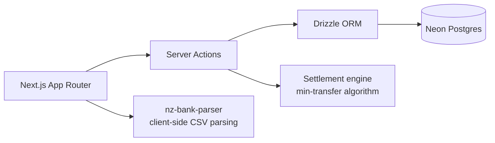

[](https://github.com/R1chi33333/flatsplit/actions/workflows/ci.yml)
[](https://codecov.io/gh/R1chi33333/flatsplit)
[](./LICENSE)

# FlatSplit — fair expenses for New Zealand flats

[Live Demo](https://flatsplit-nz.vercel.app) · [Documentation](#getting-started) · [Report Bug](https://github.com/R1chi33333/flatsplit/issues/new?template=bug_report.md)



## Why this exists

Flatting is how most young New Zealanders live, and every flat runs the same spreadsheet: rent by room size, power split evenly, groceries owed to whoever paid. Spreadsheets rot and nobody settles up. FlatSplit tracks shared expenses, imports transactions straight from your bank's CSV export, and tells everyone the fewest transfers needed to be square.

## Features

- Create a flat, invite flatmates with a code
- Record expenses with equal, ratio or fixed-amount splits
- Settlement view: who owes whom, with the minimum number of transfers
- Import bank CSV exports via [nz-bank-parser](https://github.com/R1chi33333/nz-bank-parser) and turn shared transactions into expenses in bulk
- One-click demo flat with realistic data, no signup needed
- All amounts in integer cents, so totals always add up

## How settlement works

Every expense is stored in integer cents with exact shares, so each member has a precise net position: what they paid minus what they owe. To settle, FlatSplit repeatedly matches the largest debtor with the largest creditor until everyone reaches zero. This greedy plan always needs at most n-1 transfers for n members and is exact to the cent. Finding the true minimum number of transfers is NP-hard (it embeds subset sum), and for flat-sized groups the greedy plan is optimal or within one transfer of it.



Three debtors, one creditor: three transfers and the flat is square. The engine lives in [`src/lib/settlement.ts`](./src/lib/settlement.ts) with invariant tests that apply every plan back to the balances and assert everyone lands on zero.

## Architecture



## Tech Stack

Next.js 15 (App Router), TypeScript (strict), Neon Postgres, Drizzle ORM, NextAuth, Tailwind CSS, nz-bank-parser, Vitest, Playwright. Deployed on Vercel.

## Getting Started

```bash
git clone https://github.com/R1chi33333/flatsplit.git
cd flatsplit
npm ci
cp .env.example .env.local   # fill in database URL and auth secret
npm run dev
```

## Testing

```bash
npm test               # unit tests (settlement engine, split maths, invite codes)
npm run test:coverage  # with coverage report
npm run e2e            # Playwright: demo login flow and CSV import flow
node scripts/mobile-audit.mjs  # horizontal-overflow audit at phone width
```

## Roadmap

See [ROADMAP.md](./ROADMAP.md).

## License

[MIT](./LICENSE)
